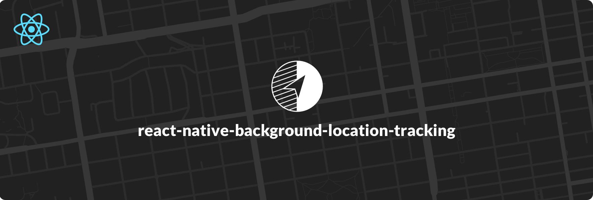

# react-native-background-location-tracking

<br/>

[](https://npmjs.org/package/react-native-background-location-tracking "View this project on npm")

[](http://commitizen.github.io/cz-cli/)
[](https://github.com/semantic-release/semantic-release)


## ** This is an Alpha Release **
## Getting started

`$ npm install react-native-background-location-tracking --save`

### Mostly automatic installation

`$ react-native link react-native-background-location-tracking`

### Manual installation


#### iOS

1. In XCode, in the project navigator, right click `Libraries` ➜ `Add Files to [your project's name]`
2. Go to `node_modules` ➜ `react-native-background-location-tracking` and add `BackgroundLocationTracking.xcodeproj`
3. In XCode, in the project navigator, select your project. Add `libBackgroundLocationTracking.a` to your project's `Build Phases` ➜ `Link Binary With Libraries`
4. Run your project (`Cmd+R`)<

#### Android

1. Open up `android/app/src/main/java/[...]/MainApplication.java`
  - Add `import com.atlasClientLocation.BackgroundLocationTrackingPackage;` to the imports at the top of the file
  - Add `new BackgroundLocationTrackingPackage()` to the list returned by the `getPackages()` method
2. Append the following lines to `android/settings.gradle`:
  	```
  	include ':react-native-background-location-tracking'
  	project(':react-native-background-location-tracking').projectDir = new File(rootProject.projectDir, 	'../node_modules/react-native-background-location-tracking/android')
  	```
3. Insert the following lines inside the dependencies block in `android/app/build.gradle`:
  	```
      compile project(':react-native-background-location-tracking')
  	```


## Usage
```javascript
import BackgroundLocationTracking from 'react-native-background-location-tracking';

// TODO: What to do with the module?
BackgroundLocationTracking;
```
